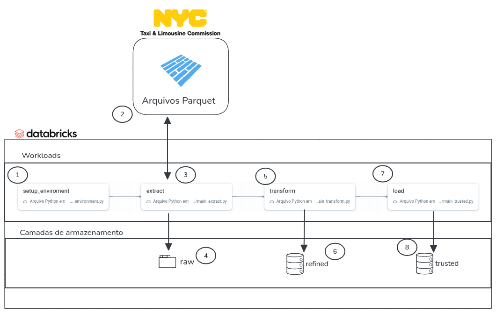

# Case Ifood - NYC Taxis

Este projeto tem como finalidade, aplicar um pipeline estruturado sobre integração de dados, permitindo que posso ser realizado análise sobre estes dados.

## Arquitetura e Estrutura do Código

Este projeto segue a seguinte arquitetura desenhada:


Na sequência vamos inciar uma explicação detalhada sobre cada processo e sua relação com o processo principal.

### Detalhamento da Arquitetura:



**1 -** Cria os diretórios das camadas (raw, trusted, curated) no sistema de arquivos do Data Lake e os bancos de dados (schemas) no metastore do Spark/Databricks.

**2, 3 e 4 -** Faz o download dos dados da camada RAW em formato Parquet, diretamente da fonte pública do NYC Taxi & Limousine Commission, com base no tipo e no período fornecidos. Faz o download e grava os dados Parquet por tipo e mês e escreve os dados baixados no caminho bruto do Data Lake.

**5 -** Transforma os dados da camada RAW e grava em formato Delta na camada Trusted, com limpeza, cast e enriquecimento dos dados.

**6 -** Aplica transformação e filtragem, persiste a tabela em Delta e orquestra todo o fluxo.

**7 -** Gera os indicadores da camada Curated, como média de valor por mês e média de passageiros por hora, com escrita em Delta.

### Detalhamento da Estrutura de Pastas
```
case_ifood_nyctaxis/
├─ .databricks/                   # Pasta utilizada pela Databricks(bundles)
├─ analisys/                      # Pasta contendo a analise do projeto
│  ├─ perguntas_de_negocio.ipynb
│  └─ README.md
├─ docs/
├─ resources/                     # Pasta com os metadados do job
│  └─ case_ifood_nyctaxis_job.yml
├─ src/
│  ├─ __init__.py
│  ├─ config_tables.yml           # Arquivo de config de metadados da tabela
│  ├─ config.yml                  # Arquivo de config do projeto
│  ├─ extract_data.py             # Arquivo com a classe responsável pela extração de dados
│  ├─ main_extract.py             # Arquivo com a chamada para o job de extração de dados
│  ├─ main_transform.py           # Arquivo com a chamada para o job de transformação dos dados
│  ├─ main_trusted.py             # Arquivo com a chamada para o job de carga das bases trusted
│  ├─ setup_environment.py        # Arquivo que inicializa os diretorios e bases do projeto
│  ├─ transform_data.py           # Arquivo com a classe responsável pela transformação dos dados
│  ├─ trusted_data.py             # Arquivo com a classe responsável pela carga dos dados na camada trusted
│  └─ utils.py                    # Arquivo com funções utilitárias para o projeto
├─ .gitignore
├─ databricks.yml
├─ pyproject.toml
└─ README.md
```
## Configuração e Incialização do Projeto

Este projeto se utiliza do Databricks Bundles, que é descrito pela própria databricks, como uma ferramenta para facilitar a adoção das práticas recomendadas de software engenharia, incluindo controle de origem, revisão de código, testes e integração e entrega contínuas (CI/CD), para projetos de dados.

### Configuração da Ferramenta para criação do pipeline
Antes de executar o projeto temos algumas premissa a seguir. Algumas delas partem da própria Databricks para que o fluxo do bundles. São elas: 
- Criar uma conta no [Databricks Free Edition](https://www.databricks.com/learn/free-edition)
- Instalar algum gerenciador de pacote python, o indicado é o [uv](https://docs.astral.sh/uv/getting-started/installation/)
- Instalar o CLI da Databricks, que pode ser seguido pela Documentação: [Databricks CLI](https://docs.databricks.com/dev-tools/cli/databricks-cli.html)

Tendo a conta criada e as ferramentas instaladas vamos seguir com o processo de incialização do projeto.

### Inicialização do projeto
Para iniciarmos o projeto vamos 
2. Authenticate to your Databricks workspace, if you have not done so already:
    ```
    $ databricks configure
    ```

3. To deploy a development copy of this project, type:
    ```
    $ databricks bundle deploy --target dev
    ```
    (Note that "dev" is the default target, so the `--target` parameter
    is optional here.)

    This deploys everything that's defined for this project.
    For example, the default template would deploy a job called
    `[dev yourname] case_ifood_nyctaxis_job` to your workspace.
    You can find that job by opening your workpace and clicking on **Workflows**.

4. Similarly, to deploy a production copy, type:
   ```
   $ databricks bundle deploy -t prod
   ```