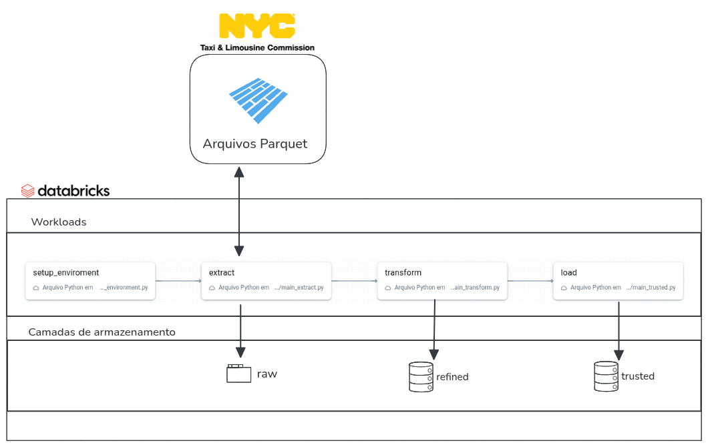
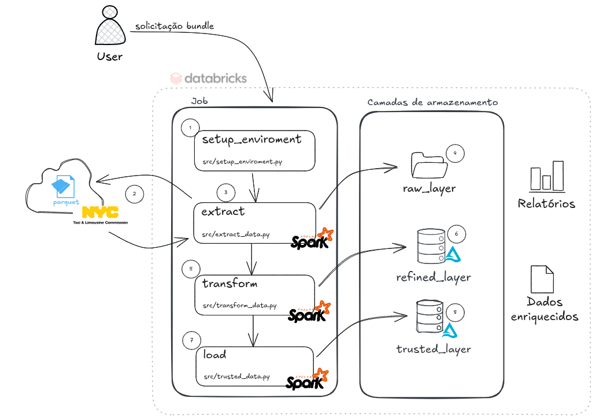

# Case Ifood - NYC Taxis

Este repositório tem como objetivo apresentar uma solução de engenharia de dados desenvolvida para tratar e analisar dados públicos de corridas de táxis da cidade de Nova York.
A arquitetura do pipeline segue uma abordagem em camadas — Raw, Refined e Trusted — que organiza a evolução dos dados desde sua ingestão bruta até a geração de informações analíticas e de valor.

O projeto foi construído utilizando Databricks e Delta Lake, garantindo escalabilidade, desempenho e rastreabilidade em todas as etapas do processamento.

## Arquitetura e Estrutura do Código

Este projeto segue a seguinte arquitetura:



Na sequência vamos inciar uma explicação detalhada sobre cada processo e sua relação com o processo principal.

### Detalhamento da Arquitetura:



**1 -** Cria os diretórios das camadas (raw, refined, trusted) no sistema de arquivos do Data Lake e os bancos de dados (schemas) no metastore do Spark/Databricks.

**2, 3 e 4 -** Faz o download dos dados da camada RAW em formato Parquet, diretamente da fonte pública do NYC Taxi & Limousine Commission, com base no tipo e no período fornecidos. Faz o download e grava os dados Parquet por tipo e mês e escreve os dados baixados no caminho bruto do Data Lake.

**5 -** Transforma os dados da camada RAW e grava em formato Delta na camada Refined, com limpeza, cast e enriquecimento dos dados.

**6 -** Aplica transformação e filtragem, persiste a tabela em Delta e orquestra todo o fluxo.

**7 -** Gera os indicadores da camada Trusted, como média de valor por mês e média de passageiros por hora, com escrita em Delta.

### Estrutura de Pastas
```
case_ifood_nyctaxis/
├─ .databricks/                   # Pasta utilizada pela Databricks(bundles)
├─ analisys/                      # Pasta contendo a analise do projeto
│  ├─ perguntas_de_negocio.ipynb
│  └─ README.md
├─ docs/
├─ resources/                     # Pasta com os metadados do job
│  └─ case_ifood_nyctaxis_job.yml
├─ src/
│  ├─ __init__.py
│  ├─ config_tables.yml           # Arquivo de config de metadados da tabela
│  ├─ config.yml                  # Arquivo de config do projeto
│  ├─ extract_data.py             # Arquivo com a classe responsável pela extração de dados
│  ├─ main_extract.py             # Arquivo com a chamada para o job de extração de dados
│  ├─ main_transform.py           # Arquivo com a chamada para o job de transformação dos dados
│  ├─ main_trusted.py             # Arquivo com a chamada para o job de carga das bases trusted
│  ├─ setup_environment.py        # Arquivo que inicializa os diretorios e bases do projeto
│  ├─ transform_data.py           # Arquivo com a classe responsável pela transformação dos dados
│  ├─ trusted_data.py             # Arquivo com a classe responsável pela carga dos dados na camada trusted
│  └─ utils.py                    # Arquivo com funções utilitárias para o projeto
├─ .gitignore
├─ databricks.yml
├─ pyproject.toml
└─ README.md
```
## Configuração e Incialização do Projeto

Este projeto se utiliza do Databricks Bundles, que é descrito pela própria databricks, como uma ferramenta para facilitar a adoção das práticas recomendadas de software engenharia, incluindo controle de origem, revisão de código, testes e integração e entrega contínuas (CI/CD), para projetos de dados.

## Configuração da Ferramenta para criação do pipeline
Antes de executar o projeto temos alguns pré-requisitos a seguir. Algumas delas partem da própria Databricks para que o fluxo do bundles. São elas: 
- Criar uma conta no [Databricks Free Edition](https://www.databricks.com/learn/free-edition)
- Instalar algum gerenciador de pacote python, o indicado é o [uv](https://docs.astral.sh/uv/getting-started/installation/)
- Instalar o CLI da Databricks, que pode ser seguido pela Documentação: [Databricks CLI](https://docs.databricks.com/dev-tools/cli/databricks-cli.html)

Tendo a conta criada e as ferramentas instaladas vamos seguir com o processo de incialização do projeto.

## Inicialização do projeto
Para iniciarmos o projeto vamos seguir os seguintes passos:

### 1. Clone do repositório:
   ```
   $ git clone https://github.com/matheus-conrado/case_ifood_nyctaxis.git
   ```

### 2. Alterar o arquivo databricks para o email cadastrado:
Necessario alterar o arquivo localizado na raiz ```databricks.yml``` adicionando o email que utilizou no cadastro para o parametro ```user_name```:
```yml
    permissions:
      - user_name: {seu_email}
        level: CAN_MANAGE
```
e na variavel ```host``` incluir a URL do console similar à:
 ```curl
   https://<sua-instancia>.databricks.com
   ```
alterar tambem em ambos os ambientes (prod e dev)
```yml
    workspace:
      host: link_host
```
### 3. Coletar as credenciais no portal da Databricks:
No console da Databricks (área já logada), vamos coletar um token para utlização na ferramenta que irá realizar o processo de deploy do nosso job. Seguindo os seguintes passos:
   1. No canto superior direito, clique no seu avatar (ícone do usuário).
   2. Selecione "Settings" (ou "Configurações").
   3. Vá até a aba de Usuário a esquerda selecione "Developer" (ou "Desenvolvedor").
   4. Na primeira opção "Access Token" (ou "Tokens de Acesso") clique em "Manage" (ou "Gerenciar").
   5. Na tela que irá abrir clique em "Generate new Token" (ou "Gerar novo Token")
   6. No popup que irá abrir dê um nome (ex: cli-token-case) e defina uma data de expiração (ex: 90 dias).
   7. Clique em "Generate" (ou "Gerar").
   8. Copie o token exibido na tela e guarde em local seguro. Você não poderá visualizá-lo novamente.

Com o token em mãos, agora vamos coletar o host, que nada mais é do que a URL inicial da platforma, coletada anteriormente:
   ```curl
   https://<sua-instancia>.databricks.com
   ```
### 4. Configurar o ```Databricks CLI```:
Com o link da instância e as credenciais geradas, agora precisamos configurar a ferramenta Databricks CLI. Com um terminal aberto, digite o seguinte comando:
   ```
   $ databricks configure
   ```
Ao teclar enter algo nessa linha deve aparecer:
   ```bash
   $  databricks configure
   ✗ Databricks host: https://
   ```
Basta inserir a URL coletada e ao precisar enter o terminal irá solicitar o token de acesso, bastar colar o token e precionar enter, e pronto Databricks CLI configurado.

Caso queira realizar um teste para entender se até então toda configuração está correta, basta rodar o seguinte comando, lembrando que deve navegar até o diretorio do projeto que foi clonado:
   ```
   $ databricks bundle validate
   ```   
Ao como este deve parecer no seu terminal:
```bash
seu@pc:~/git/case_ifood_nyctaxis$ databricks bundle validate
Name: case_ifood_nyctaxis
Target: dev
Workspace:
  Host: https://seuhost.databricks.com
  User: seu_email@email.com
  Path: /Workspace/Users/seu_email@email.com/.bundle/case_ifood_nyctaxis/dev

Validation OK!
```
Se esta for a mensagem, podemos processeguir para o deploy.

### 5. Realizar o deploy da aplicação:
Com todos os passos acima realizado com sucesso, você ja pode realizar o deploy do job com seus codigos. Basta rodar o seguinte comando para ```dev```:
   ```
   $ databricks bundle deploy -t dev
   ```
>**Observação:** a flag padrão é "dev", portanto o uso do parâmetro --target é opcional neste caso.
>
>Esse comando implanta todos os elementos definidos para o projeto atual.
Por exemplo, o modelo padrão criará uma tarefa chamada
_[dev seu_email] case_ifood_nyctaxis_job_ no seu workspace.
>
>Para visualizar essa tarefa, acesse o console Databricks e clique em Jobs e Pipelines no menu lateral.

Agora caso queria realizar o deploy para produção, basta processar o seguinte comando:
   ```
   $ databricks bundle deploy -t prod
   ```
### 6. Processar o job:
Deploy realizado para etapa de processamento basta, acessar o Console Databricks, no menu esquerdo selecionar "Job e Pipeline", e acionar no botão play, ou ao acessar o job clicar no botão a direita "Executar Agora".

Caso queira processar o job usando a linha de comando basta rodar o seguinte comando no terminal:
   ```
   $ databricks bundle run
   ```
   Que ira processar em ambiente ```dev``` ou com a tag prod para o ambiente de produção:

   ```
   $ databricks bundle deploy -t prod
   ```
### Imagens do processamento realizado:


## Escolhas importantes para o projeto

* Com base na solicitação e seguindo alguns escopos levantados com base nos campos usados para a analise, optamos por carregar os dados de taxis amarelos e taxis verdes, focando na integração de dados que trariam valor para a analise.

* Pensando em futuros reprocessamentos dos dados, os workloads foram criados usando variaveis como argumento para as task, o que facilitaria também chamadas externas as task atraves da API do Databricks.

* Ainda pensando em reprocessamento, para facilitar a dinamica foi aplicado a configuração de ```.partitionOverwriteMode()``` ao save de dados em tabelas. Essa configuração possibilita que dentro da camada Refined os dados sejam sobrescritos no caso apenas nas partições que foram passadas para a task.

* A escolha do uso de VOLUMES no workspace ou VOLUMES do Unity Catalog, foi pensando unicamente em facilitar a dinamica do processo de desenvolvimento deste case, mas poderia facilmente ser trocado por um contêinere básico de armazenamento de dados. Por este motivo foi pensado o arquivo de configuração onde podemos fornecer o path de forma dinamica do bucket caso necessário.
